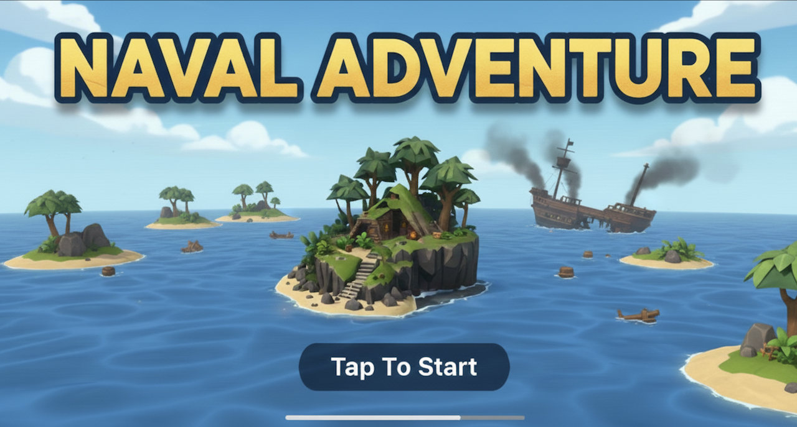
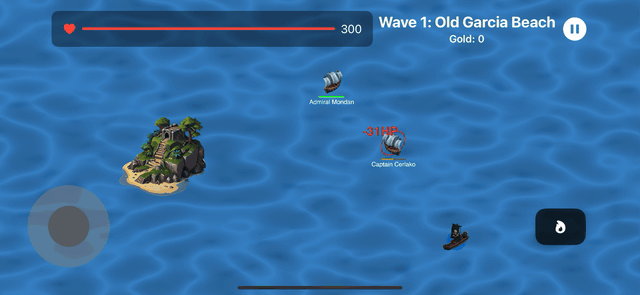

# Naval Adventure

Welcome to Naval Adventure, a 2.5D top-down naval action game for iOS! Take command of your own ship, navigate treacherous waters, and battle waves of enemy vessels. Collect loot, upgrade your ship, and become the most feared captain on the high seas.

## Showcase

Check out a quick demo of the core gameplay loop:

## Features

### Combat Mechanics
- **Targeting and Firing:** Tap any enemy to lock on, then toggle an "Auto-Fire" button to unleash a continuous barrage. The player ship automatically orients towards its target, but movement remains independent, allowing for skilled maneuvering while shooting.
- **Dynamic Damage Model:** Damage is calculated based on range. Shots fired at optimal close range (<=20% of screen height) deal 80-100% of their potential damage, which then falls off linearly to a minimum value at longer distances.
- **Critical Hit System:** Features a dual system for critical hits: a base percentage that can be upgraded, plus a dynamic 85% chance for massive damage on high-risk, point-blank shots (<=10% of screen height).
- **Visual Flair:** Ships display different sprites based on their movement direction. Defeated enemies trigger a custom explosion animation and fade out smoothly.

### Loot & Economy
- **Automatic Collection:** Loot is automatically awarded to the player upon an enemy's defeat, keeping the focus on the action.
- **Diverse Rewards:** Standard enemies drop gold, while formidable "Dreadnought" bosses drop a large bounty plus a guaranteed "Repair Kit" that fully heals the player.
- **Interest Mechanic:** A clever "interest" system rewards skilled play. Any healing received while at full health and shields is converted into a small amount of gold.
- **Instant Feedback:** Floating text indicators provide immediate confirmation for damage dealt, health gained, and loot collected.

### World & Enemy Design
- **Procedural Waves:** Each new wave is given a unique, procedurally generated name.
- **Dynamic Environments:** The battlefield is filled with randomly generated islands that act as full obstacles, blocking both ship movement and cannon fire.
- **Varied Enemy AI:**
    - **Standard Ships:** Patrol randomly until the player enters their range.
    - **Chaser Ships:** Aggressively pursue the player in tactical bursts.
    - **Dreadnoughts (Bosses):** Spawn every 3 waves with massive health, higher damage, a chance to crit, and constant, menacing movement.
- **Enemy Identity:** Each enemy ship is assigned a randomly generated name displayed below it, adding a touch of personality to your foes.

### Deep Upgrade System
- A multi-category store allows for deep customization of your ship:
    - **Gunnery:** Improve minimum damage potential and critical hit stats.
    - **Ordnance:** Purchase different cannonball types and decrease reload time.
    - **Carpenter:** Increase the number of cannons fired per volley.
    - **Shipyard:** Increase the ship's base movement speed.
    - **Consumables:** Purchase a "Full Repair" and get ready to set sail with full healthpoints.

## Architecture

This project is built with a modern, clean, and scalable hybrid architecture that leverages the distinct strengths of Apple's frameworks for UI and game development.

- **SpriteKit (The Game Engine):** The real-time game world is managed entirely by SpriteKit. This includes rendering all game objects (ships, islands, projectiles), running the core game loop, managing physics and collision detection, and executing all real-time game logic like AI and combat calculations.

- **SwiftUI (The UI Layer):** All user interface elements are built with SwiftUI for rapid, modern, and maintainable development. This includes the main menu, the in-game display (HUD), the upgrade store, and all overlay menus.

- **Data Flow & State Management:** The connection between the two frameworks is carefully managed for a clear separation of concerns:
    - A `SpriteView` is used within the SwiftUI view hierarchy to host the SpriteKit scene.
    - **`PlayerStats`:** An `ObservableObject` class acts as the single source of truth for the player's persistent data (gold, HP, upgrades). It is created once and passed as an environment object to both the SwiftUI views and the `GameScene`.
    - **`GameScene`:** The scene itself is also an `ObservableObject`, publishing game-specific, real-time states (like the current target or auto-fire status) directly to the SwiftUI HUD, ensuring the UI always reflects the immediate state of the game.

## How to Run the Project

1.  Make sure you have Xcode installed.
2.  Clone this repository to your local machine.
3.  Open the `ShipTapper.xcodeproj` file in Xcode.
4.  Select your target device (or a simulator).
5.  Click the "Run" button (or press `Cmd+R`).

## Future Development

This project is an ongoing work in progress. Here are some of the planned improvements:

*   **Sound Design:** Adding background music and sound effects for a more immersive experience.
*   **Visual Polish:** Replacing placeholder graphics with high-quality sprites and adding more particle effects.
*   **Advanced AI:** Creating more complex and challenging enemy behaviors.
*   **Persistence:** Implementing a save system to store player progress.
